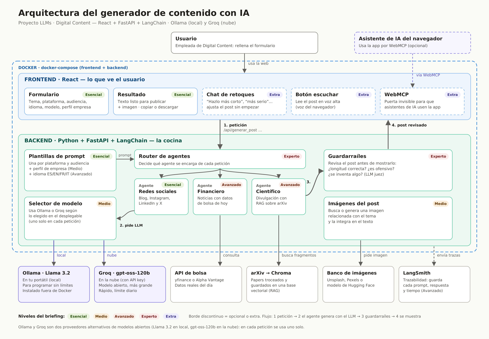

# IdeaLab Content

Generador de contenido para blogs y redes sociales con IA generativa: LLMs, LangChain, RAG y agentes.

> 🚧 **En desarrollo.** Prueba de concepto construida por niveles, de Esencial a Experto.

## Qué es

**Digital Content** es una agencia que publica a diario en blogs, Instagram, LinkedIn y X.
IdeaLab Content genera contenido **listo para publicar**, con texto e imagen, a partir de un tema,
una plataforma, una audiencia y un idioma, usando solo modelos locales o APIs gratuitas.

## Arquitectura objetivo

Diseño completo del sistema. Se construye por niveles: la tabla de **Estado** indica qué partes están ya implementadas.



- **Frontend:** React, Vite y Tailwind CSS.
- **Backend:** Python, FastAPI y LangChain.
- **Modelos:** Llama en local con Ollama, o en la nube con Groq.
- **Avanzado:** RAG sobre papers de arXiv con Chroma, trazabilidad con LangSmith y agentes con LangGraph.

## Estado

| Nivel | Contenido | Estado |
|---|---|---|
| 🟢 Esencial | Posts por plataforma y audiencia, interfaz web | ⏳ |
| 🟡 Medio | Selector de modelo, perfil de empresa, imágenes, Docker | ⏳ |
| 🟠 Avanzado | LangSmith, cuatro idiomas, noticias financieras, RAG científico | ⏳ |
| 🔴 Experto | Guardarraíles, multiagente, Graph RAG | ⏳ |

## Metodología

El proyecto sigue un enfoque de **desarrollo guiado por especificaciones**. Antes de programar,
el diseño y las tareas se definen en `.specify/`:

- [`1_spec.md`](.specify/1_spec.md): qué se construye, decisiones de arquitectura y contratos.
- [`2_plan.md`](.specify/2_plan.md): cómo se organiza el trabajo.
- [`3_tasks.md`](.specify/3_tasks.md): tareas con su criterio de "hecho" y calendario.

Cada tarea tiene su issue, su rama y su pull request. El progreso se sigue en el tablero del proyecto.

## Cómo arrancarlo

*Las instrucciones completas se añadirán al cerrar el nivel Esencial.*

### Activar el detector de secretos

Después de clonar el repositorio, activa la comprobación automática que impide subir claves por error:

```bash
uv tool install pre-commit
pre-commit install
```

## Herramientas de desarrollo

- **VS Code**: editor
- **Git y GitHub**: control de versiones, issues y tablero Kanban
- **Docker Desktop**: contenedores
- **Claude**: asistente para consulta técnica y revisión de código

## Licencia

[MIT](LICENSE)
